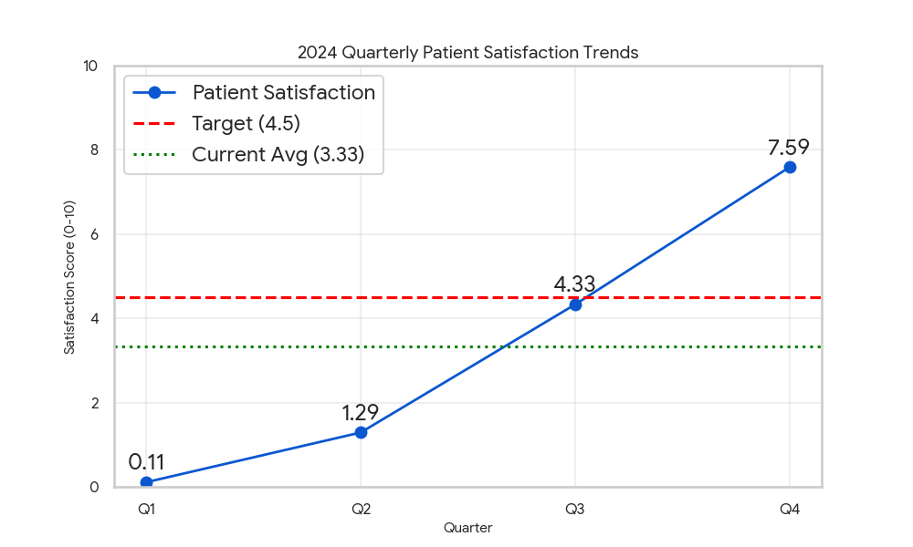

# Healthcare Performance Analysis: Patient Satisfaction Story

**Analyst Email:** 23f2000060@ds.study.iitm.ac.in

## Executive Summary
This analysis reviews the quarterly patient satisfaction scores for 2024. While the annual average remains below target due to a poor start, the year-end trend is highly positive.

## Key Findings
* **Current Average Score:** 3.33 (Below the industry target of 4.5).
* **Trend:** Scores improved dramatically from a low of 0.11 in Q1 to 7.59 in Q4.
* **Benchmark:** We successfully exceeded the 4.5 benchmark in Q4.

## Business Implications
The low average indicates early-year operational struggles, but the Q4 recovery suggests recent changes are effective.

## Recommendations
To ensure we consistently beat the target next year, our primary strategy is to **improve service quality and wait times**.

## Data Summary
| Quarter | Score |
|---------|-------|
| Q1      | 0.11  |
| Q2      | 1.29  |
| Q3      | 4.33  |
| Q4      | 7.59  |
| **Avg** | **3.33** |
